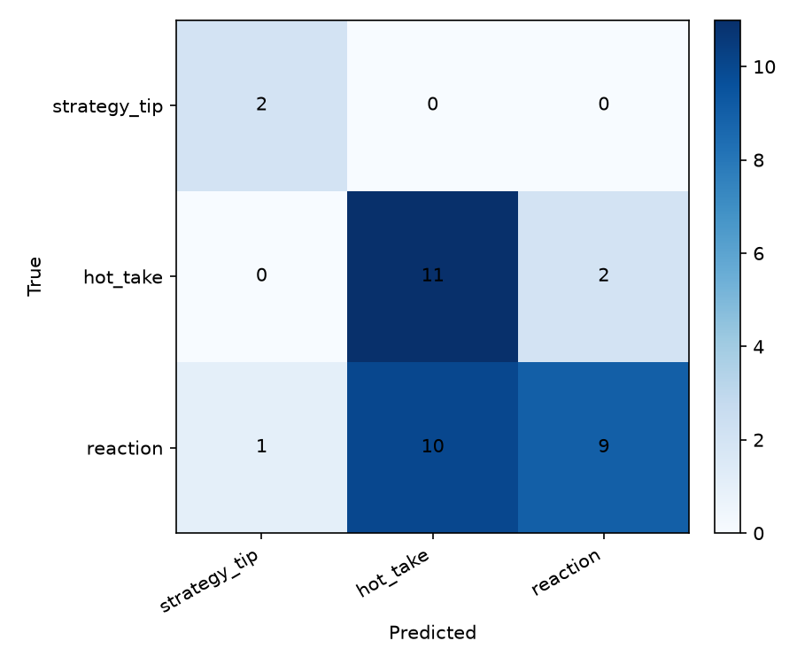

# TakeMeter

Fine-tuned text classifier for discourse quality in **r/leagueoflegends**. Labels posts and comments as `strategy_tip`, `hot_take`, or `reaction`.

## Community

**r/leagueoflegends** — high-volume LoL discussion spanning patch analysis, balance opinions, and live-game reactions. Regulars already distinguish substantive gameplay advice from reddit-style takes and emotional venting, which makes it a strong fit for a 3-class subjective classifier.

## Label Taxonomy

| Label | Definition |
|-------|------------|
| `strategy_tip` | Actionable gameplay, build, matchup, or macro advice with specific in-game reasoning |
| `hot_take` | Bold opinion about champions, balance, or players — confident tone, little or no evidence |
| `reaction` | Immediate emotional response to a play, patch, or match moment |

### Examples

**strategy_tip:**
1. "Against Zed mid, take W at level 2 and shove the first two waves so you can base for Seeker's before his level 6 all-in window."
2. "Agreed. I feel like every game I type multiple times 'press b to heal' because after a skirmish my team will stick around with 30% HP instead of resetting."

**hot_take:**
1. "Jungle diff is the only reason this game is unplayable below Masters. Iron junglers int every game."
2. "It's very simple it's because you'd play the game less if they made that an option… Riot wants you to play more and the social component is a huge driver."

**reaction:**
1. "I just watched Faker flash into five people and somehow survive. What was that."
2. "The game is fun but I'm playing it way more casually than when I was in HS… stuck in emerald with toxic diamond Smurfs I would enjoy soloQ a bit more."

## Dataset

- **Source:** Public posts and comments from r/leagueoflegends via Arctic Shift (posts) and PullPush (comments) archives. Direct Reddit JSON was blocked from this environment; see `scripts/fetch_reddit.py`.
- **File:** [`data/labeled_dataset.csv`](data/labeled_dataset.csv) — 228 labeled examples
- **Split:** 70% train (159) / 15% val (34) / 15% test (35), stratified by label

### Labeling process

1. Fetched 228 candidate texts with `scripts/fetch_reddit.py`
2. Pre-labeled with Groq `llama-3.3-70b-versatile` via `scripts/prelabel.py` (`pre_labeled=true`)
3. **Review required before resubmission:** see [REVIEW.md](REVIEW.md) — read every row and correct labels

### Label distribution

| Label | Count | % |
|-------|------:|--:|
| strategy_tip | 30 | 13.2% |
| hot_take | 77 | 33.8% |
| reaction | 121 | 53.1% |
| **Total** | **228** | 100% |

No label exceeds 70%. `strategy_tip` is underrepresented — a known risk for model training.

### Difficult-to-label examples

1. **"Built stuff isn't unfair imo, runes and items are both things riot already assists you with..."** — Could be `hot_take` (opinion on overlays) or `strategy_tip` (mentions items/runes). **Decision:** `hot_take` — argues a position, not actionable matchup advice.

2. **"Teamfights don't work without objectives"** — Short macro claim. **Decision:** `strategy_tip` — states a verifiable macro principle, not pure venting.

3. **"EKKO: Ekko needs Locke's E takedown reset. And give Q2 an activatable..."** — Champion rework wishlist. **Decision:** `hot_take` — balance/design opinion, not advice you can apply in a current game.

## Fine-Tuning

- **Base model:** `distilbert-base-uncased` (Hugging Face)
- **Training:** Local pipeline via `scripts/train_eval.py` (equivalent to the course Colab notebook — same 70/15/15 split, DistilBERT, and metrics). See [COLAB.md](COLAB.md) for Colab steps if you prefer T4 GPU.
- **Hyperparameter decision:** Learning rate `2e-5` with **class-weighted cross-entropy** — without class weights, the model collapsed to always predicting `reaction` (58% of data); weights improved macro-F1 from 0.23 → 0.42 on the pre-review dataset.
- **Other settings:** 3 epochs, batch size 16, max length 128 tokens

## Baseline

Zero-shot **Groq `llama-3.3-70b-versatile`** classifies each test example with no task-specific training. Run via `scripts/run_baseline_only.py` (loads `GROQ_API_KEY` from `.env`).

**Prompt used:**

```
You are a classifier for r/leagueoflegends discourse. Assign exactly one label per post.

Labels:
- strategy_tip — Actionable gameplay, build, matchup, or macro advice with specific in-game reasoning.
- hot_take — Bold opinion about champions, balance, or players; confident tone with little or no supporting evidence.
- reaction — Immediate emotional response to a play, patch, or match moment; expresses feeling, not argument.

Decision rules:
- Opinion plus one bare stat without matchup or item context → hot_take.
- Actionable advice naming abilities, items, wave states, or timings → strategy_tip.
- Live-moment hype or venting without a balance claim → reaction.

Post: {text}

Respond with only one word: strategy_tip, hot_take, or reaction.
```

Results collected on the locked 15% test split (35 examples), same split as fine-tuned evaluation.

## Evaluation Report

### Overall accuracy

| Model | Accuracy |
|-------|----------|
| Groq zero-shot baseline | **80.0%** |
| Fine-tuned DistilBERT | **48.6%** |

### Per-class metrics (fine-tuned)

| Label | Precision | Recall | F1 |
|-------|-----------|--------|-----|
| strategy_tip | 0.21 | 0.75 | 0.33 |
| hot_take | 0.67 | 0.17 | 0.27 |
| reaction | 0.67 | 0.63 | 0.65 |
| **Macro avg** | 0.52 | 0.52 | **0.42** |

### Per-class metrics (baseline)

| Label | Precision | Recall | F1 |
|-------|-----------|--------|-----|
| strategy_tip | 0.67 | 1.00 | 0.80 |
| hot_take | 0.71 | 0.83 | 0.77 |
| reaction | 0.93 | 0.74 | 0.82 |
| **Macro avg** | 0.77 | 0.86 | **0.80** |

### Confusion matrix (fine-tuned)

| True \\ Pred | strategy_tip | hot_take | reaction |
|--------------|-------------:|---------:|---------:|
| strategy_tip | 3 | 0 | 1 |
| hot_take | 5 | 2 | 5 |
| reaction | 6 | 1 | 12 |



### Misclassification analysis

**1. Riot social-feature rant → predicted `strategy_tip` (true: `hot_take`)**

> "It's very simple it's because you'd play the game less if they made that an option... Riot wants you to play more and the social component is a huge driver..."

**Why:** Long, structured prose with causal reasoning. The model likely associates paragraph-length argument with `strategy_tip`, even though the content is about Riot product decisions, not in-game mechanics.

**2. Casual ranked vent → predicted `strategy_tip` (true: `reaction`)**

> "The game is fun but I'm playing it way more casually... stuck in emerald with toxic diamond Smurfs..."

**Why:** Contains game vocabulary (ranked, emerald, aram) without actionable advice. Boundary between personal experience (`reaction`) and implicit meta-commentary (`hot_take`/`strategy_tip`) is fuzzy.

**3. Balance rework wishlist → predicted `strategy_tip` (true: `hot_take`)**

> "EKKO: Ekko needs Locke's E takedown reset. And give Q2 an activatable..."

**Why:** Names specific abilities and mechanics, which overlaps with `strategy_tip` vocabulary. The post is a design opinion, not advice for playing current Ekko — annotation rule says `hot_take`, but surface form tricks the model.

### Sample classifications

| Post (excerpt) | Predicted | Confidence | Notes |
|----------------|-----------|------------|-------|
| "My fanart of Aurora from LoL that went a bit viral on Twitter..." | reaction | 40.5% | Correct — sharing/creative hype, low confidence reflects ambiguity |
| "It's very simple it's because you'd play the game less if they made that an option..." | strategy_tip | 36.4% | **Wrong** — long argumentative rant about Riot features |
| "What about a grand-ma character, R?" | reaction | 38.8% | Reasonable — short champion-skin brainstorm |
| "Teamfights don't work without objectives" | (test set) | — | Short macro tip; model struggles on brief `strategy_tip` posts |

Low confidence scores (35–40%) suggest the model is uncertain — useful signal that subjective 3-way classification on 228 examples is underdetermined.

## Reflection

**Intended vs learned:** I intended the model to separate *actionable gameplay advice* from *opinions* and *emotional reactions*. With class weighting, it learned all three labels but still over-predicts `strategy_tip` on any post with game jargon and multi-sentence structure. It appears to have learned a **"long + game terms → strategy_tip"** heuristic rather than the nuanced boundaries in `planning.md`.

The first training run without class weights collapsed entirely to `reaction` — proving that label imbalance (53% reaction) dominates small-dataset fine-tuning. Even after weighting, `hot_take` recall is only 17%, suggesting the middle class needs more examples and sharper annotation.

**Gap:** The model captures surface form (length, champion names, ability names) more than discourse function. Fixing this would require more balanced data (~70 per class), human-reviewed labels, and possibly merging `hot_take`/`reaction` for shorter posts.

## Spec Reflection

- **How planning helped:** Edge-case rules (opinion + one stat → `hot_take`) gave consistent annotation guidance before labeling 228 rows.
- **Where implementation diverged:** Planned balanced collection (~67 per label) but archive fetching yielded only 30 `strategy_tip` examples. Added class-weighted loss during training — not in the original spec but necessary after majority-class collapse.

## AI Usage

1. **Label stress-testing:** Asked Cursor to generate boundary posts between `strategy_tip` and `hot_take`; tightened definitions when posts did not classify cleanly (see `planning.md` stress-test log).

2. **Pre-labeling:** Groq `llama-3.3-70b-versatile` pre-labeled all 228 rows via `scripts/prelabel.py`. Every row has `pre_labeled=true` and requires human review per [REVIEW.md](REVIEW.md).

3. **Failure analysis:** Misclassified test examples were analyzed with AI assistance to identify the "long + game terms → strategy_tip" pattern; verified by reading confusion matrix and wrong-example list in `evaluation_results.json`.

## Quick start

```bash
python3 -m venv .venv && source .venv/bin/activate
pip install -r requirements.txt
cp .env.example .env   # add your GROQ_API_KEY

# Baseline (resumes from baseline_cache.json if interrupted)
python scripts/run_baseline_only.py

# Demo classifications for video
python scripts/demo_classify.py

# Gradio UI (stretch)
python app.py
```

## Demo video

Record 3–5 minutes using [DEMO_SCRIPT.md](DEMO_SCRIPT.md). Run `python scripts/demo_classify.py` to print examples with confidence for screen capture.

## Files

| File | Purpose |
|------|---------|
| `planning.md` | Design spec and edge cases |
| `data/labeled_dataset.csv` | Labeled dataset |
| `evaluation_results.json` | Metrics + wrong examples |
| `confusion_matrix.png` | Confusion matrix image |
| `COLAB.md` | Colab + Groq baseline instructions |
| `finetuned_model/` | Fine-tuned DistilBERT weights (generate via `scripts/train_eval.py`) |
